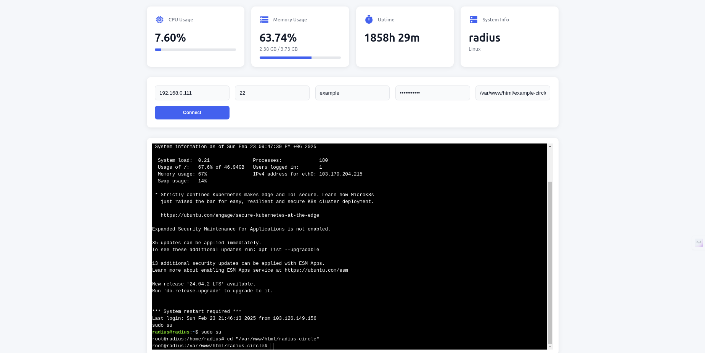

# 🖥️ Web SSH Client: Your Browser-Based Terminal

Connect to your servers right from your browser! This modern SSH client comes with a sleek interface and real-time system monitoring - making server management a breeze.



## ✨ What's Cool About It?

### 🔌 Terminal That Just Works
- Jump into your servers straight from your browser
- Everything works like your regular terminal
- Smart enough to handle sudo commands for you
- Keeps you connected even if things get shaky
- No more "terminal size" headaches

### 📊 Keep an Eye on Your Server
- Watch CPU usage in real-time with pretty graphs
- See how much memory you're using
- Check uptime without typing commands
- Get system info at a glance
- Updates every 2 seconds - always fresh!

### 🎨 Clean & Simple Design
- Easy on the eyes
- Works great on phones too
- Neat cards that show you everything you need
- Nice loading bars to visualize resources
- Modern icons that make sense

### 🔐 Secure & Convenient
- Remembers your settings (so you don't have to)
- Handles passwords safely
- One password for everything (SSH & sudo)
- Connects back automatically if something drops
- Clear messages when something's not right

## 🚀 Getting Started

1. Grab the code:
```bash
git clone https://github.com/mdshemul48/remotix
cd ssh-web-client
```

2. Set things up:
```bash
npm install
```

3. Fire it up:
```bash
node index.js
```

4. Open it up:
```
http://localhost:3000
```

## 🛠️ Built With
- Node.js - The engine
- Express - The framework
- WebSocket - The real-time stuff
- SSH2 - The connection magic
- Xterm.js - The terminal bits
- Material Icons - The pretty bits

## 🤝 Want to Help?
Got ideas? Found a bug? Want to make it better? Jump in! We love contributions!

## 📜 License
MIT License - Take it, use it, make it better!

---
Made with ❤️ for developers who love simple tools that work
